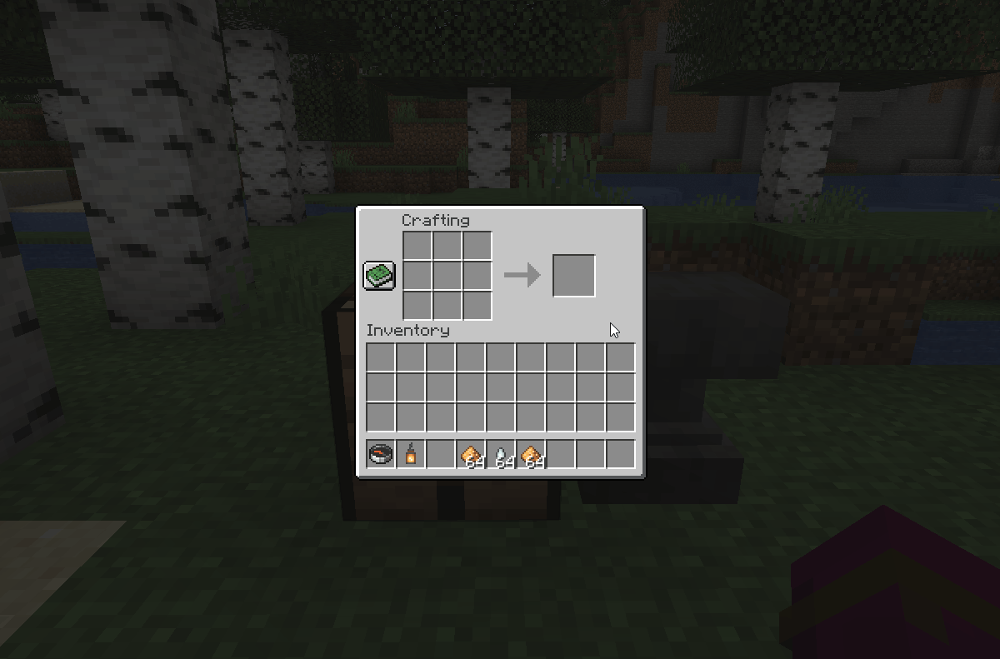

# Regions
A plugin to carve up your minecraft world into named regions.

For most of minecraftian history, players, server owners, and content builders
have sought to find a way around one of the least exciting problems in
minecraft: How to travel long distances on a big world.

In 2010, Mojang gave us minecarts. Using some clever physics glitches,
minecrafters devised minecart boosters to send them through distant lands at a
modest speed.

Later that year, we all set sail for the infinite seas upon our new boats.
Travel was swift, provided water.

Soon after, we were blessed with the bright magicks of redstone and powered
rails. No longer did minecrafters need to rely on janky collision physics to
move ourselves through the non-aquatic world.

With the Beta 1.9 release, Ender pearls and speed potions were introduced. We
catapulted ourselves to terrifying new heights and found the world that much
smaller.

After the Beta era, Mojang bestowed upon us a terrifying and awesome power:
Nether portals. Soon long distance travel was a reasonable idea, if you didn't
mind losing your entire inventory to an errant ghast or lava pool.

The 1.9 update allowed us to take to the sky with Elytra, and 1.11 sent us into
the distant horizon with firework rockets. With enough determination, a compass,
and some gunpowder, the world was all that much smaller to us.

And yet, we remain unsatiated. Dissatisfied with the high cost of elytra and the
regular need to move great distances quickly, a great number of server plugins
that included teleportation proliferated the pages of spigotmc.org.

And yet still, we remain dissatisfied. Typing out a /warp or /home command is
trivial. Instantaneous teleportation at your fingertips might sound great, but
there remains a distinct un-minecraftian feel about it.

What if there was a more immersive way to add fast travel to your server?

What if your players didn't need to do impossible feats like scrying some runes
into a "chat box", something out of place from the minecraft world?

For your consideration: **Regions**

## Features
- Point-to-point teleportation with a GUI
  
- Create a point of interest in your world, give it a name, apply a banner.
  
- Fast travel routes between POIs are automatically established.
- Create World Hubs, accessable from any other POI on the world
- Players can only travel to POI's they've already explored
  
- An incredibly cool and flashy teleportation effect
- Pay for your fast travel with XP levels
- Attempting to jump without enough XP might lead to a dangerous misfire,
  dropping you an unexpected distance from your destination.
- Level up your region posts with craftable Region Post Charges
- Not enough XP? No worries, you can pay for the ticket with a post's stored
  charges
- Craft a Region Compass to locate the nearest region post
- Wrap a latern in charges to create an anchor with which any player can create
  their own local region post
  
- Restrict any of the above features using permissions
- Get a spiffy notification whenever you cross a region's border and enter a new
  land
- Dynmap integration
- Asynchronous chunk loading and teleportation on Paper servers that all but
  eliminates teleportation-induced lag
